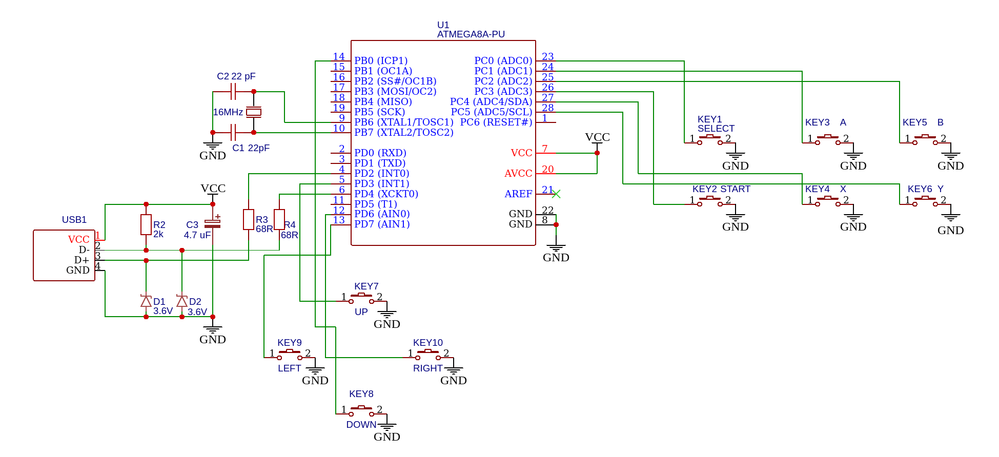

# Simple V-USB Joystick

This uses V-USB to implement a USB joystick with minimal code. It supports up, down, left, right and 6 buttons.

It can run on ATmega8, ATmega328 and other MCUs.

This project based on [gblargg/vusb-joystick](https://github.com/gblargg/vusb-joystick).

### Schematic
